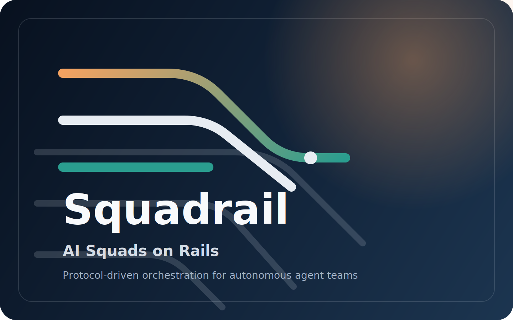

<p align="center">
  
</p>

<p align="center">
  <a href="#quickstart"><strong>Quickstart</strong></a> &middot;
  <a href="docs/start/architecture.md"><strong>Architecture</strong></a> &middot;
  <a href="docs/api/overview.md"><strong>API</strong></a> &middot;
  <a href="docs/cli/overview.md"><strong>CLI</strong></a> &middot;
  <a href="doc/DEVELOPING.md"><strong>Development</strong></a>
</p>

<p align="center">
  <a href="LICENSE">
    
  </a>
  <a href="https://github.com/twpark-ops/squadrail/stargazers">
    
  </a>
  = 20" />
  = 9" />
</p>

<br/>

# Protocol-first orchestration for autonomous software delivery

**Squadrail** is an open-source control plane for AI agent teams working on real engineering tasks.

The project builds on top of [**Paperclip**](https://github.com/paperclipai/paperclip) and extends it into a delivery-focused orchestration system — adding typed protocol messaging, role-based agent workflows, structured review handoffs, runtime recovery, and graph-assisted knowledge retrieval as first-class operating surfaces.

<br/>

## Why Squadrail

Most AI coding tools treat agents as isolated terminals: one prompt in, one output out. Squadrail takes a different approach — agents operate **inside a delivery system** with explicit roles, protocol-enforced state transitions, and auditable review gates.

| Problem | Squadrail's answer |
|---------|-------------------|
| Agents produce code but nobody reviews it | Structured review handoff with diff summary, test evidence, and approval gates |
| No visibility into what agents are doing | Live run dashboard, heartbeat monitoring, recovery queue |
| Context is copy-pasted prompt dumps | Graph-assisted retrieval grounded in repository knowledge and task history |
| All agents do the same thing | Role-based execution — leads plan, engineers implement, reviewers verify, QA gates enforce |
| Work state lives in chat threads | Typed protocol messages with validated state transitions |

<br/>

## Core operating surfaces

### 1. Delivery protocol

Issues move through typed protocol messages with validated transitions, evidence requirements, and review gates. Every state change is traceable.

```text
Issue Created → ASSIGN_TASK → Hybrid Retrieval → Task Brief
    → START_IMPLEMENTATION → REPORT_PROGRESS → SUBMIT_FOR_REVIEW
    → START_REVIEW → APPROVE / REQUEST_CHANGES → CLOSE_TASK
```

### 2. Role-based execution

Each agent operates within a defined role. Leads own routing and escalation. Engineers implement. Reviewers verify. QA gates enforce quality. Operators recover failures.

### 3. Retrieval-backed task context

Context is assembled from repository knowledge, document links, revision history, and role-aware retrieval signals — not broad copy-pasted code blocks. The retrieval stack includes:

- Hybrid dense + sparse search
- Graph-assisted chunk and document linking
- Version-aware, authority-ranked results
- Retrieval cache with incremental reindex
- Role-specific personalization

### 4. Runtime and recovery

Live runs, heartbeats, recovery queues, and operator actions are visible from one control plane. Failures are grouped by family, scored for retryability, and surfaced before they cascade.

### 5. Governance and audit

Review handoffs, approvals, protocol violations, closures, and recovery decisions remain inspectable. Every protocol message is stored with sender role, evidence, and timestamp.

<br/>

## Current status

The current system baseline is no longer just a prototype UI. The core delivery contract has been hardened and repeatedly validated:

- **Batch A shipped** — issue documents, deliverables, and overview-level current delivery visibility
- **Canonical stabilization completed** — the core delivery loop now passes `full delivery`, `clarification`, `changes requested recovery`, `QA gate`, and `merge/deploy follow-up`
- **Repeat validation locked** — the canonical bundle passes `ITERATIONS=3 pnpm e2e:canonical-repeat`
- **P2 autonomy hardening completed** — `swiftsight-agent-tl-qa-loop` now completes with `fallback total = 0`
- **Current reliability backlog** — live-model E2E nondeterminism and persistent-server repeat validation

See:

- [docs/PLANS.md](docs/PLANS.md)
- [docs/RELIABILITY.md](docs/RELIABILITY.md)
- [docs/exec-plans/completed/p2-autonomy-fallback-hardening-plan-2026-03-19.md](docs/exec-plans/completed/p2-autonomy-fallback-hardening-plan-2026-03-19.md)
- [docs/exec-plans/completed/p1-retrieval-stabilization-plan.md](docs/exec-plans/completed/p1-retrieval-stabilization-plan.md)

<br/>

## Control plane UI

The control plane provides operational visibility across the entire delivery lifecycle:

- **Work** — Kanban board (default), list view, and operational queue dashboard in one tabbed interface
- **Changes** — Review desk, implementation lanes, and merge candidates organized by delivery stage
- **Runs** — Live execution, recovery backlog, and recent heartbeat history
- **Team** — Supervision view, agent roster, coverage analysis, and performance scorecards
- **Knowledge** — Document ingestion, retrieval graphs, and connected knowledge surfaces
- **Issue detail** — Protocol cards, delivery party with agent links, brief/protocol/comments tabs

<br/>

## Technical highlights

- **Protocol over chat.** Work is driven by typed messages and explicit transitions, not loosely-scoped conversation history.
- **Structured review handoff.** `SUBMIT_FOR_REVIEW` expects implementation summary, diff summary, changed files, test results, checklist, residual risk, and review artifacts.
- **Graph-assisted retrieval.** Temporal, role-aware retrieval with document versioning, cache, incremental reindex, and explainable personalization. See [docs/design-docs/rag-current-architecture.md](docs/design-docs/rag-current-architecture.md).
- **Knowledge stays attached to delivery.** Retrieval is grounded in issues, projects, runs, and evolving repository state — not a detached chatbot layer.
- **Local-first development.** Embedded PostgreSQL is auto-managed in development. The CLI bootstraps and diagnoses a local instance in one command.
- **Pluggable adapters.** Ships with adapters for Claude Code, Codex, Cursor, OpenClaw, and OpenCode — all running locally.
- **Multi-tenant.** Company and team isolation in a single deployment with role-based access control.

<br/>

## Monorepo structure

```text
cli/                          CLI for onboarding, diagnostics, and operations
server/                       Express + TypeScript API, realtime, auth, services
ui/                           React + Vite control-plane UI
packages/db/                  Drizzle ORM schema and migrations (PostgreSQL)
packages/shared/              Shared types, constants, and contracts
packages/adapter-utils/       Common adapter utilities
packages/adapters/
  ├── claude-local/           Claude Code local adapter
  ├── codex-local/            OpenAI Codex local adapter
  ├── cursor-local/           Cursor local adapter
  ├── openclaw/               OpenClaw adapter
  └── opencode-local/         OpenCode local adapter
docker/                       Docker support files
docs/                         Product, API, CLI, and architecture documentation
doc/                          Development guides and internal specs
scripts/                      Build, dev, and operational scripts
```

<br/>

## Documentation maps

The repository now uses a harness-style docs layout:

- [ARCHITECTURE.md](ARCHITECTURE.md) — repository architecture entry point
- [docs/PRODUCT_SENSE.md](docs/PRODUCT_SENSE.md) — product-level overview and direction
- [docs/DESIGN.md](docs/DESIGN.md) — design and architecture map
- [docs/PLANS.md](docs/PLANS.md) — active and completed execution plans
- [docs/RELIABILITY.md](docs/RELIABILITY.md) — canonical E2E and runtime reliability
- [docs/SECURITY.md](docs/SECURITY.md) — security baseline and hardening
- [docs/QUALITY_SCORE.md](docs/QUALITY_SCORE.md) — review findings and quality posture
- [AGENTS.md](AGENTS.md) — short repository map for coding agents

Plan and spec placement follows these rules:

- active execution plans: `docs/exec-plans/active/`
- completed plans: `docs/exec-plans/completed/`
- design docs: `docs/design-docs/`
- product specs: `docs/product-specs/`

<br/>

## Quickstart

### Prerequisites

- **Node.js** 20 or later
- **pnpm** 9 or later
- **Git**

### From source

```bash
git clone https://github.com/twpark-ops/squadrail.git
cd squadrail
pnpm install
pnpm squadrail run
```

This bootstraps a local instance (including embedded PostgreSQL), runs diagnostics, and starts the server at **http://localhost:3100**.

### Standard development mode

```bash
pnpm install
pnpm dev
```

Starts the API server and UI dev middleware on the same origin at `http://localhost:3100`.

### Docker

```bash
# Standalone
docker build -t squadrail-local .
docker run --name squadrail \
  -p 3100:3100 \
  -e HOST=0.0.0.0 \
  -e SQUADRAIL_HOME=/squadrail \
  -v "$(pwd)/data/docker-squadrail:/squadrail" \
  squadrail-local

# Or with Compose (quickstart — embedded PostgreSQL)
docker compose -f docker-compose.quickstart.yml up --build

# Or with Compose (production — external PostgreSQL)
docker compose up --build
```

### Environment variables

Copy `.env.example` to `.env` and fill in your keys:

```bash
cp .env.example .env
```

Key variables:

| Variable | Required | Description |
|----------|:--------:|-------------|
| `OPENAI_API_KEY` | Yes* | OpenAI API key for knowledge retrieval embeddings |
| `ANTHROPIC_API_KEY` | Yes* | Anthropic API key for Claude adapter |
| `BETTER_AUTH_SECRET` | Auth mode | Secret for session signing (`openssl rand -base64 32`) |
| `DATABASE_URL` | External PG | PostgreSQL connection string |
| `SQUADRAIL_DEPLOYMENT_MODE` | No | `local_trusted` (default) or `authenticated` |

*At least one AI provider key is needed for agent execution.

<br/>

## How work flows through Squadrail

```text
┌─────────────────────────────────────────────────────────────────┐
│                        DELIVERY LIFECYCLE                       │
├─────────┬──────────────┬──────────────┬────────────┬────────────┤
│  PLAN   │   EXECUTE    │   REVIEW     │  APPROVE   │   CLOSE    │
│         │              │              │            │            │
│ Issue   │ Retrieval    │ Submit for   │ Approve or │ Close task │
│ created │ + brief      │ review       │ request    │ or recover │
│         │ + implement  │ + evidence   │ changes    │            │
│ Assign  │              │              │            │ Audit      │
│ roles   │ Report       │ Start review │ QA gate    │ trail      │
│         │ progress     │              │ (optional) │            │
└─────────┴──────────────┴──────────────┴────────────┴────────────┘
```

Every protocol step can enforce: state validation, role validation, required evidence, retrieval refresh, runtime dispatch, and review/closure rules.

<br/>

## Useful commands

```bash
# Development
pnpm dev                          # full-stack development server
pnpm dev:server                   # server only
pnpm dev:ui                       # UI only

# Quality
pnpm typecheck                    # typecheck all workspaces
pnpm test:run                     # run all tests
pnpm build                        # build all packages
pnpm docs:check                   # validate docs placement and links

# Operations
pnpm squadrail run                # bootstrap + doctor + start
pnpm squadrail doctor             # diagnostics and repair hints

# Database
pnpm db:generate                  # generate a migration
pnpm db:migrate                   # apply pending migrations

# Knowledge
pnpm knowledge:rebuild-graph      # rebuild graph-oriented knowledge data
pnpm knowledge:rebuild-versions   # rebuild document version state

# Smoke tests
pnpm smoke:local-ui-flow          # browser smoke test for main UI flow

# Canonical E2E
pnpm e2e:full-delivery            # canonical full delivery path
ITERATIONS=3 pnpm e2e:canonical-repeat
```

<br/>

## Deployment modes

| Mode | Auth | Network | Use case |
|------|:----:|---------|----------|
| **Local trusted** | None | Loopback only | Local development, solo testing |
| **Authenticated private** | Enabled | Private network | Tailscale, internal team access |
| **Authenticated public** | Enabled | Public hostname | Internet-facing self-hosted |

See [doc/DEVELOPING.md](doc/DEVELOPING.md) for environment details, bootstrap flow, and configuration reference.

<br/>

## Documentation

| Guide | Description |
|-------|-------------|
| [Architecture Map](ARCHITECTURE.md) | Repository-level map for code and docs entry points |
| [Plans Map](docs/PLANS.md) | Active vs completed execution plans |
| [Reliability Map](docs/RELIABILITY.md) | Canonical E2E, stabilization, runtime validation |
| [Security Map](docs/SECURITY.md) | Security baseline, auth, and deployment guardrails |
| [Quality Map](docs/QUALITY_SCORE.md) | Review findings and hardening programs |
| [Architecture](docs/start/architecture.md) | System design, component boundaries, data flow |
| [API Overview](docs/api/overview.md) | REST endpoints, protocol message contracts |
| [CLI Overview](docs/cli/overview.md) | Commands, flags, diagnostics |
| [Board Operator Guide](docs/guides/board-operator/dashboard.md) | Operating the control plane day-to-day |
| [Agent Developer Guide](docs/guides/agent-developer/how-agents-work.md) | Building and configuring agents |
| [Development Guide](doc/DEVELOPING.md) | Local setup, testing, contributing |
| [RAG Architecture](docs/design-docs/rag-current-architecture.md) | Retrieval stack design and internals |

<br/>

## Contributing

Contributions are welcome. See [CONTRIBUTING.md](CONTRIBUTING.md) for development workflow, code style, and PR expectations.

<br/>

## Community

- [GitHub Issues](https://github.com/twpark-ops/squadrail/issues) — Bug reports and feature requests
- [GitHub Discussions](https://github.com/twpark-ops/squadrail/discussions) — Questions and ideas

<br/>

## License

MIT &copy; 2026 Squadrail — see [LICENSE](LICENSE) for details.

<br/>

---

<p align="center">
  <sub>Built for teams that want AI agents to deliver software with protocol, context, and accountability.</sub>
</p>
